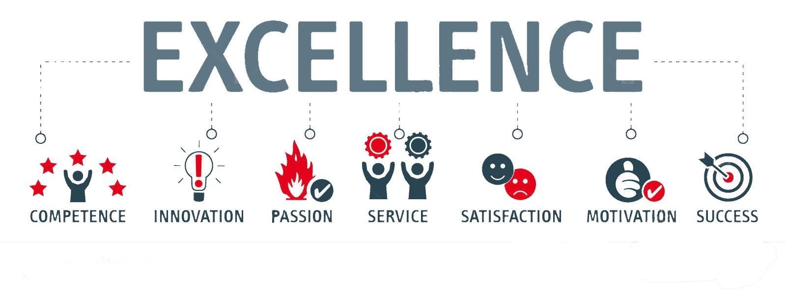

<h1 align="center" style="font-family: 'Courier New', monospace;">const Bryan_Wienhoff = () => { return Quality, Passion, Drive }</h1>

<h2 align="center">Full Stack Web Developer with a passion for creating stunning and functional interfaces with intuitive organized backend functionality. </h2>

 
 

  

- 👨‍💻 See all of my projects in my [**Portfolio**](https://hoffalypse.github.io/bryan-wienhoff-portfolio/)

- 🔭 I’m currently working on [**Unscrolled Web Interface for Ganing Platform **](https://github.com/Hoffalypse/earthship-packaging-dev)
- ⚡ The powerful projects from me.

  - **Enterprise Applications**: [**Integral Solutions**](https://github.com/stevecalla/integral-solutions-dev), [**Earthship Packaging**](https://github.com/Hoffalypse/earthship-packaging-dev)
  - **Personal Projects**: [**Hoff AI**](https://github.com/Hoffalypse/AI-Photo-Booth), [**Bob Dylan Video Archives**](https://github.com/Hoffalypse/Bob-Dylan-Archive)
  - **Team Projects**: [**Forest Firefighter App**](https://github.com/moyuh/fire-fighter-tracking), [**WOW Team Builder APP**](https://github.com/Hoffalypse/mythic-plus-team), [**Bandopedia Music App**](https://github.com/joseeenrique/Music-App)
  - **Gist**: [**Regex Tutorial**](https://gist.github.com/Hoffalypse/cf5958a7cc7296c4e9e038948962f603)

- 🌱 I’m currently studying [**React Native**](https://github.com/Hoffalypse/Shopinmy-react-native)

- 📫 How to reach me: **bhoff1980@gmail.com**

- ⚡ Fun fact: **I have played and cashed in multiple World Series of Poker Events!**

<h3 align="center">Front End Development</h3>

   &nbsp
     
    &nbsp
   &nbsp
   &nbsp
   &nbsp
   &nbsp
   &nbsp
  
  

<h3 align="center">Back End Development</h3>

   &nbsp
   &nbsp
  
  

<h3 align="center">Database</h3>

   &nbsp
  

<h3 align="center">Data Visualization</h3>

  

<h3 align="center">Devops</h3>

   &nbsp
   &nbsp
  

<h3 align="center">Testing</h3>

  

<h3 align="center">Other</h3>

   &nbsp
  

   
<h2 align="center">Connect With Me:</h3>

 &nbsp &nbsp
 &nbsp &nbsp

